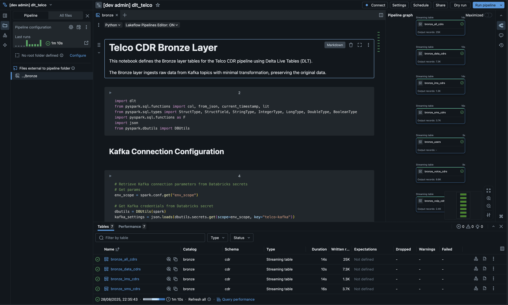
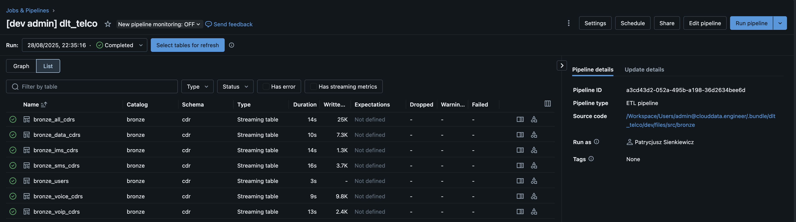
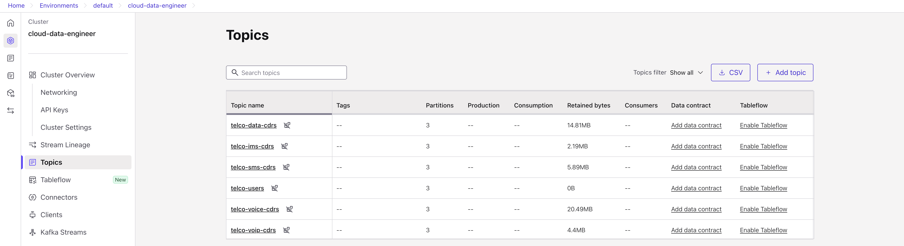

# Telco CDR Processing Pipeline with Databricks Delta Live Tables

A modern, scalable pipeline for processing telecommunications Call Detail Records (CDRs) using Databricks Delta Live Tables and the medallion architecture pattern.

## 🏗️ Architecture Overview

This project implements a complete telco data processing pipeline following the medallion architecture:

- **Bronze Layer**: Raw data ingestion from Kafka streams
- **Silver Layer**: Data validation, cleansing, and standardization *(Coming Soon)*
- **Gold Layer**: Business-ready aggregations and analytics *(Coming Soon)*

## 📊 Data Sources

The platform processes multiple types of telecommunications data:

- **User Profiles**: Subscriber information (MSISDN, IMSI, IMEI, plans)
- **Voice CDRs**: Call detail records with duration and routing info
- **Data CDRs**: Data session records with usage volumes
- **SMS CDRs**: Text message transaction records
- **VoIP CDRs**: Voice over IP call records
- **IMS CDRs**: IP Multimedia Subsystem session records

## 🥉 Bronze Layer Implementation

### Overview

The bronze layer provides raw data ingestion from Kafka topics with minimal transformation, preserving original data for compliance and auditability.



### Key Features

- **Streaming Ingestion**: Real-time data processing from Kafka
- **Schema Preservation**: Maintains original message structure
- **Metadata Tracking**: Captures Kafka metadata (timestamp, topic, key)
- **Security**: Secure credential management via Databricks secrets
- **Scalability**: Serverless Delta Live Tables for auto-scaling

### Bronze Tables

| Table Name | Source Topic | Description |
|------------|--------------|-------------|
| `bronze_users` | `telco-users` | Raw user profile data with parsed JSON |
| `bronze_voice_cdrs` | `telco-voice-cdrs` | Voice call detail records |
| `bronze_data_cdrs` | `telco-data-cdrs` | Data session records |
| `bronze_sms_cdrs` | `telco-sms-cdrs` | SMS message records |
| `bronze_voip_cdrs` | `telco-voip-cdrs` | VoIP call records |
| `bronze_ims_cdrs` | `telco-ims-cdrs` | IMS session records |
| `bronze_all_cdrs` | All CDR topics | Multiplexed view of all CDR types |



### Table Schema

All bronze tables follow a consistent schema:

```sql
CREATE TABLE bronze_<type> (
  key STRING,                    -- Kafka message key
  timestamp TIMESTAMP,           -- Kafka message timestamp
  topic STRING,                  -- Source Kafka topic
  processing_time TIMESTAMP,     -- DLT processing timestamp
  raw_data STRING,              -- Original JSON payload
  parsed_data STRUCT<...>       -- Parsed JSON (users table only)
)
```

### Configuration

The bronze layer uses Databricks secrets for secure Kafka connectivity:

```python
# Kafka credentials stored in Databricks secrets
kafka_settings = json.loads(dbutils.secrets.get(scope=env_scope, key="telco-kafka"))
```

### Deployment

Deploy the bronze layer pipeline using Databricks Asset Bundles:

```bash
# Deploy to development
cd dlt_telco
databricks bundle deploy --target dev

# Deploy to production
databricks bundle deploy --target prod
```

## 🔧 Data Generator



### Purpose

For development and testing, the project includes a synthetic data generator that produces realistic telco CDRs.

### Components

- **User Generator**: Creates synthetic subscriber profiles
- **CDR Generator**: Produces realistic call detail records
- **Kafka Producer**: Streams data to Kafka topics
- **Export Utilities**: Batch export capabilities

### Usage

1. **Generate Users**:
   ```bash
   cd ../src/cdr/data_generator
   python user_generator.py
   ```

2. **Export Users to Kafka**:
   ```bash
   python export_users_to_kafka.py \
     --bootstrap-servers $KAFKA_BOOTSTRAP_SERVERS \
     --sasl-username $KAFKA_API_KEY \
     --sasl-password $KAFKA_API_SECRET \
     --topic telco-users \
     --num-users 1000
   ```

3. **Stream CDRs**:
   ```bash
   python kafka_producer.py \
     --bootstrap-servers $KAFKA_BOOTSTRAP_SERVERS \
     --sasl-username $KAFKA_API_KEY \
     --sasl-password $KAFKA_API_SECRET \
     --interval 0.5 \
     --users-file users.json
   ```

## 🚀 Getting Started

### Prerequisites

- Databricks workspace with Unity Catalog enabled
- Kafka cluster (Confluent Cloud recommended)
- Python 3.8+
- Databricks CLI

### Setup

1. **Install dependencies**:
   ```bash
   pip install -r ../requirements.txt
   ```

2. **Configure Databricks CLI**:
   ```bash
   databricks configure
   ```

3. **Set up Kafka credentials** in Databricks secrets:
   ```bash
   databricks secrets create-scope telco
   databricks secrets put-secret telco telco-kafka --string-value '{
     "bootstrap_server": "your-kafka-server",
     "api_key": "your-api-key",
     "api_secret": "your-api-secret"
   }'
   ```

4. **Deploy the pipeline**:
   ```bash
   databricks bundle deploy --target dev
   ```

5. **Start data generation**:
   ```bash
   cd ../src/cdr/data_generator
   python export_users_to_kafka.py --num-users 1000
   python kafka_producer.py --interval 1
   ```

## 🔍 Monitoring and Observability

- **DLT Pipeline Metrics**: Built-in monitoring via Databricks UI
- **Data Quality**: Automatic schema enforcement and validation
- **Performance**: Auto-optimization enabled for all bronze tables

## 🛡️ Security and Compliance

- **Credential Management**: All secrets stored in Databricks Secret Scopes
- **Data Lineage**: Full tracking via Unity Catalog
- **Access Control**: Fine-grained permissions on tables and pipelines
- **Audit Trail**: Complete processing history maintained

## 📈 Performance Characteristics

- **Throughput**: Handles millions of records per minute
- **Latency**: Sub-second processing for real-time analytics
- **Scalability**: Serverless compute auto-scales based on load
- **Cost Optimization**: Automatic optimization and compaction

## 🔮 Roadmap

- [ ] **Silver Layer**: Data validation and standardization
- [ ] **Gold Layer**: Business metrics and KPIs
- [ ] **Real-time Analytics**: Streaming aggregations
- [ ] **ML Integration**: Fraud detection and churn prediction
- [ ] **API Layer**: REST APIs for data access

## 📚 Documentation

- [Bronze Layer Deep Dive](../PART1.md)
- [Data Generator Guide](../src/cdr/data_generator/README.md)

## 📄 License

This project is licensed under the MIT License - see the LICENSE file for details.